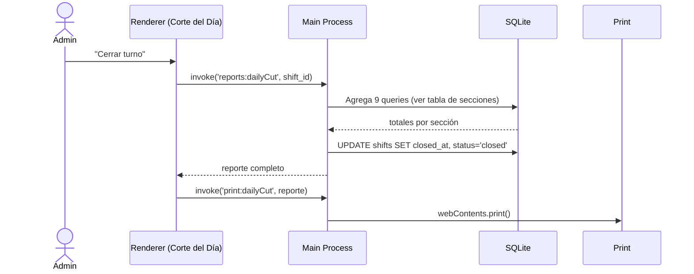
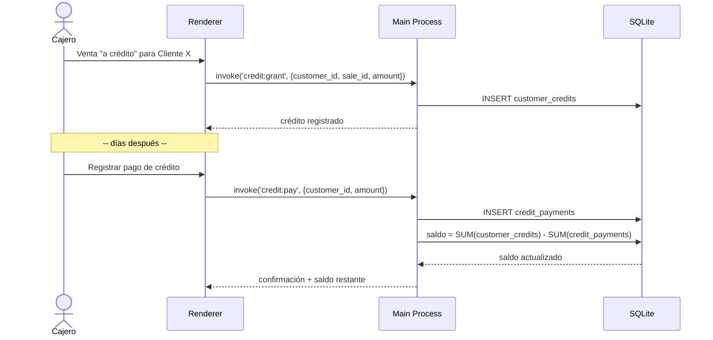

# Design: POS de escritorio "Bahía de los Ángeles" (pos-inicial)

## Technical Approach

Electron (decisión cerrada en `exploration.md`/`proposal.md`, no se reabre) con
proceso principal en TypeScript, acceso a datos vía `node:sqlite` (built-in de
Node, sin módulos nativos que compilar), IPC seguro (`contextIsolation: true` +
`preload`), renderer en React + Vite (vía `electron-vite`), impresión con
`webContents.print()` sobre HTML/CSS de 80mm, y CI en GitHub Actions con
runner `macos-latest` para producir `.dmg` sin firma pagada. Cubre las 7
capacidades del proposal (`catalog-management`, `sales-transactions`,
`cash-register`, `customer-credit`, `daily-report`, `auth-roles`,
`ticket-printing`).

## Architecture Decisions

| # | Decisión | Elegido | Alternativas rechazadas | Por qué |
|---|----------|---------|--------------------------|---------|
| 1 | Acceso a SQLite | `node:sqlite` (built-in, main process) | `better-sqlite3` compilado desde fuente; `sqlite3` (node-sqlite3) | `better-sqlite3` tiene riesgo documentado de fallo de cross-compilación Windows→Mac (mitigable pero no cero); `node:sqlite` viene embebido en el runtime que Electron ya empaqueta — cero módulos nativos que compilar/descargar en CI. Costo: es experimental en Node 22.x (ver Open Questions) y solo accesible desde el main process, pero esa restricción coincide con el patrón de seguridad que ya se adopta (punto 2). |
| 2 | IPC | `contextIsolation: true` + `preload` con `contextBridge.exposeInMainWorld` | `nodeIntegration: true` sin aislar | Patrón de seguridad estándar de Electron moderno; además es la única vía de acceso a `node:sqlite` desde la UI, así que no es una capa extra opcional sino la arquitectura obligatoria. |
| 3 | Renderer stack | React + TypeScript + Vite, scaffolded con `electron-vite` | Vanilla JS/DOM; Vue | Precedentes maduros de Electron+Vite (HMR rápido en dev), y las 6 pantallas (login, ventas, catálogo, caja, créditos, corte del día) se modelan bien como componentes; equipo ya conoce JS/TS (ver "Curva de aprendizaje" en proposal). |
| 4 | Hash de PIN | `node:crypto` `scryptSync` + `timingSafeEqual` (sin librería externa) | `bcrypt` (nativo/compilado) | Mismo criterio que la decisión 1: evitar cualquier módulo nativo adicional que reintroduzca el riesgo de cross-compilación que justamente se descartó al elegir `node:sqlite`. `scrypt` es built-in y suficiente para 2 PINs compartidos (no hay superficie de ataque de red). |
| 5 | Migraciones de esquema | Definidas como array TypeScript embebido en código (no archivos `.sql` sueltos) | Archivos `.sql` cargados desde disco en runtime | Los archivos empaquetados dentro de un `.asar` tienen rutas de resolución frágiles en producción; un array TS compilado con el bundle evita ese problema por completo y es trivialmente versionable/aditivo (ver sección Migraciones). |
| 6 | Borrado de departamentos/productos | Soft-delete (columna `active`) | `DELETE` físico | Un departamento/producto "eliminado" por el Administrador puede tener ventas históricas ya registradas (`sale_lines` las referencia); borrar físicamente rompería la integridad de reportes pasados y el corte del día de días anteriores. |
| 7 | Snapshot de departamento/costo/precio en la venta | `sale_lines` copia `department_id`, `unit_cost`, `unit_price` al momento de la venta | Solo FK a `products` y hacer `JOIN` en tiempo de reporte | Si el Administrador reasigna el departamento de un producto o cambia costo/precio después, los reportes de días anteriores ("ventas por departamento", "ganancia del día") deben seguir reflejando la realidad histórica, no el estado actual del catálogo. |
| 8 | Empaquetado Mac sin firma pagada | Firma ad-hoc explícita (`codesign --sign -`) forzada en CI + bypass manual de Gatekeeper en instalación | Certificado Apple Developer Program (99 USD/año) + notarización | Fuera de scope según proposal (`Out of Scope`); Apple Silicon exige AL MENOS firma ad-hoc o el proceso recibe `SIGKILL` — se fuerza explícitamente en el pipeline en vez de depender del comportamiento implícito de `electron-builder` sin certificado, para no dejarlo a una heurística no verificada. |

## Esquema de Base de Datos (SQLite)

```sql
-- Roles con PIN compartido (no cuentas individuales)
CREATE TABLE roles (
  id INTEGER PRIMARY KEY,
  name TEXT NOT NULL UNIQUE CHECK(name IN ('usuario','administrador')),
  pin_salt TEXT NOT NULL,
  pin_hash TEXT NOT NULL
);

CREATE TABLE departments (
  id INTEGER PRIMARY KEY,
  name TEXT NOT NULL UNIQUE,
  active INTEGER NOT NULL DEFAULT 1,
  created_at TEXT NOT NULL DEFAULT (datetime('now'))
);

CREATE TABLE products (
  id INTEGER PRIMARY KEY,
  department_id INTEGER NOT NULL REFERENCES departments(id),
  name TEXT NOT NULL,
  barcode TEXT UNIQUE,
  cost REAL NOT NULL,
  price REAL NOT NULL,
  active INTEGER NOT NULL DEFAULT 1,
  created_at TEXT NOT NULL DEFAULT (datetime('now')),
  updated_at TEXT
);

CREATE TABLE shifts (               -- turno de caja
  id INTEGER PRIMARY KEY,
  opened_at TEXT NOT NULL DEFAULT (datetime('now')),
  closed_at TEXT,
  opened_by_role_id INTEGER NOT NULL REFERENCES roles(id),
  closed_by_role_id INTEGER REFERENCES roles(id),
  opening_cash REAL NOT NULL,
  closing_cash_counted REAL,
  status TEXT NOT NULL DEFAULT 'open' CHECK(status IN ('open','closed'))
);

CREATE TABLE cash_movements (       -- entradas de efectivo / salidas a proveedores
  id INTEGER PRIMARY KEY,
  shift_id INTEGER NOT NULL REFERENCES shifts(id),
  type TEXT NOT NULL CHECK(type IN ('entrada','salida')),
  concept TEXT NOT NULL,
  amount REAL NOT NULL,
  created_at TEXT NOT NULL DEFAULT (datetime('now'))
);

CREATE TABLE sales (                -- encabezado de venta
  id INTEGER PRIMARY KEY,
  shift_id INTEGER NOT NULL REFERENCES shifts(id),
  status TEXT NOT NULL DEFAULT 'completed' CHECK(status IN ('completed','voided')),
  subtotal REAL NOT NULL,
  total REAL NOT NULL,
  created_at TEXT NOT NULL DEFAULT (datetime('now'))
);

CREATE TABLE sale_lines (
  id INTEGER PRIMARY KEY,
  sale_id INTEGER NOT NULL REFERENCES sales(id),
  product_id INTEGER NOT NULL REFERENCES products(id),
  department_id INTEGER NOT NULL,   -- snapshot, ver Decisión 7
  quantity REAL NOT NULL,
  unit_price REAL NOT NULL,         -- snapshot
  unit_cost REAL NOT NULL,          -- snapshot
  line_total REAL NOT NULL
);

CREATE TABLE sale_payments (        -- soporta pago dividido efectivo/tarjeta
  id INTEGER PRIMARY KEY,
  sale_id INTEGER NOT NULL REFERENCES sales(id),
  method TEXT NOT NULL CHECK(method IN ('efectivo','tarjeta')),
  amount REAL NOT NULL
);

CREATE TABLE customers (
  id INTEGER PRIMARY KEY,
  name TEXT NOT NULL,
  phone TEXT,
  active INTEGER NOT NULL DEFAULT 1,
  created_at TEXT NOT NULL DEFAULT (datetime('now'))
);

CREATE TABLE customer_credits (     -- crédito otorgado ("fiado")
  id INTEGER PRIMARY KEY,
  customer_id INTEGER NOT NULL REFERENCES customers(id),
  sale_id INTEGER REFERENCES sales(id),
  shift_id INTEGER NOT NULL REFERENCES shifts(id),
  amount REAL NOT NULL,
  note TEXT,
  created_at TEXT NOT NULL DEFAULT (datetime('now'))
);

CREATE TABLE credit_payments (
  id INTEGER PRIMARY KEY,
  customer_id INTEGER NOT NULL REFERENCES customers(id),
  shift_id INTEGER NOT NULL REFERENCES shifts(id),
  method TEXT NOT NULL DEFAULT 'efectivo' CHECK(method IN ('efectivo','tarjeta')),
  amount REAL NOT NULL,
  created_at TEXT NOT NULL DEFAULT (datetime('now'))
);

CREATE TABLE schema_migrations (
  version INTEGER PRIMARY KEY,
  name TEXT NOT NULL,
  applied_at TEXT NOT NULL DEFAULT (datetime('now'))
);
```

**Cálculo de "Ganancia del día"**: `SUM(sale_lines.quantity * (unit_price - unit_cost))` filtrado por `shift_id`.

**Corte del Día (8/9 secciones)** — todas filtradas por `shift_id`:

| Sección | Query base |
|---|---|
| Entradas de efectivo | `SUM(cash_movements.amount) WHERE type='entrada'` |
| Ventas de contado | `SUM(sale_payments.amount)` (todas las formas de pago) |
| Salidas/Proveedores | `SUM(cash_movements.amount) WHERE type='salida'` |
| Dinero en caja | `opening_cash + entradas efectivo + pagos efectivo - salidas` |
| Dinero en bancos | `SUM(sale_payments.amount) WHERE method='tarjeta'` |
| Ventas totales | `SUM(sales.total) WHERE status='completed'` |
| Ganancia del día | ver fórmula arriba |
| Pagos de créditos | `SUM(credit_payments.amount)` |
| Ventas por departamento | `SUM(sale_lines.line_total) GROUP BY department_id` (join a `departments.name`) |

## Migraciones de Esquema

Versionadas como array TypeScript (Decisión 5), no archivos `.sql` sueltos:

```ts
// src/main/db/migrations/index.ts
export const migrations = [
  { version: 1, name: 'init', sql: [/* CREATE TABLE ... todo el esquema arriba */] },
  { version: 2, name: 'seed_roles', sql: [/* INSERT INTO roles ... */] },
  // futuras: SOLO ALTER TABLE ADD COLUMN o CREATE TABLE — nunca DROP/RENAME
];
```

Al arrancar el main process: crear `schema_migrations` si no existe → por cada
migración con `version > MAX(schema_migrations.version)`, ejecutar en una
transacción y registrar la fila. Esto hace real el rollback plan del
proposal: reinstalar un `.dmg` anterior no requiere down-migrations porque
todas las migraciones aplicadas son estrictamente aditivas.

## Diagramas de Secuencia

### Venta completa con escáner

```mermaid
sequenceDiagram
    actor Cajero
    participant Scanner as Escáner USB-HID
    participant UI as Renderer (Ventas)
    participant Main as Main Process
    participant DB as SQLite (node:sqlite)
    participant Print as BrowserWindow oculta

    Cajero->>Scanner: Escanea código de barras
    Scanner->>UI: keydown rápidos + Enter
    UI->>UI: Heurística ráfaga (<50ms/char) + Enter = código
    UI->>Main: invoke('catalog:findByBarcode', codigo)
    Main->>DB: SELECT * FROM products WHERE barcode=?
    DB-->>Main: producto (precio, costo, depto)
    Main-->>UI: producto
    UI->>UI: Agrega línea a venta en curso
    Cajero->>UI: Confirma pago (efectivo/tarjeta/dividido)
    UI->>Main: invoke('sales:create', venta)
    Main->>DB: BEGIN; INSERT sales+sale_lines+sale_payments; COMMIT
    Main->>Main: Genera HTML ticket (plantilla 80mm)
    Main->>Print: webContents.print()
    Print-->>Cajero: Ticket impreso
    Main-->>UI: sale_id confirmado
```

### Corte de caja / día



### Crédito de cliente



## Estructura de Carpetas

```
pescaderia-pos/
├── src/
│   ├── main/
│   │   ├── index.ts              # entry, BrowserWindow, ciclo de vida
│   │   ├── preload.ts            # contextBridge.exposeInMainWorld
│   │   ├── db/
│   │   │   ├── connection.ts     # node:sqlite open + pragma
│   │   │   ├── migrations/index.ts
│   │   │   └── queries/          # products.ts, sales.ts, cash.ts, credit.ts, reports.ts
│   │   ├── ipc/                  # un handler por dominio (ipcMain.handle)
│   │   ├── printing/
│   │   │   ├── ticket-template.ts
│   │   │   └── print.ts
│   │   └── auth/pin.ts           # scryptSync + timingSafeEqual
│   └── renderer/
│       ├── screens/              # login, ventas, catalogo, caja, creditos, corte-dia
│       ├── components/
│       └── ipc-client.ts         # wrapper tipado sobre window.api
├── db/schema.sql                 # espejo de referencia (documentación, no runtime)
├── .github/workflows/build-mac.yml
├── electron-builder.yml
└── package.json
```

## Impresión de Tickets

- Plantilla HTML con las secciones del ticket de referencia, generada en el
  main process (`ticket-template.ts`) como string con los datos de la venta o
  del corte del día interpolados.
- CSS obligatorio: `@page { size: 80mm auto; margin: 0 }` + `body { width: 80mm; font-family: monospace }`.
- Se carga en una `BrowserWindow` oculta (`show: false`) vía `loadURL('data:text/html,...')` o `loadFile` a un archivo temporal, y se invoca `win.webContents.print({ silent: false })` (diálogo nativo, sin ESC/POS crudo, sin driver propio).

## Escáner USB-HID

Vive en el renderer, dentro de la pantalla de Ventas: un listener `keydown` a
nivel de documento acumula caracteres; si el gap entre teclas es consistente
con velocidad de escáner (<50ms) y termina en `Enter`, se trata como código de
barras completo y se dispara `catalog:findByBarcode`. Si el gap es mayor
(tecleo humano) o no termina en `Enter`, el buffer se descarta. Sin
integración especial de hardware — el sistema operativo ya lo entrega como
teclado.

## Autenticación por PIN de Rol

Pantalla de login con teclado numérico (0-9, borrar, confirmar). Al confirmar,
`invoke('auth:login', pin)` → main itera las 2 filas de `roles`, calcula
`scryptSync(pin, role.pin_salt, 64)` y compara con `timingSafeEqual` contra
`role.pin_hash`. Nunca se guarda el PIN en texto plano. La sesión (rol activo)
vive solo en memoria del renderer — no se persiste; cerrar la app exige
re-ingresar PIN.

## Pipeline CI/CD (GitHub Actions)

```yaml
name: build-mac
on:
  push: { tags: ["v*.*.*"] }
  workflow_dispatch: {}
jobs:
  build-mac:
    runs-on: macos-latest
    strategy:
      matrix: { arch: [arm64, x64] }
    steps:
      - uses: actions/checkout@v4
      - uses: actions/setup-node@v4
        with: { node-version: 22 }
      - run: npm ci
      - run: npm run build
      - name: Build .app sin empaquetar
        run: npx electron-builder --mac --${{ matrix.arch }} --dir --publish never
      - name: Firma ad-hoc explícita (evita SIGKILL en Apple Silicon)
        run: |
          APP=$(find dist -maxdepth 2 -name "*.app" -print -quit)
          codesign --force --deep --sign - "$APP"
      - name: Empaquetar .dmg desde el .app ya firmado
        run: npx electron-builder --mac --${{ matrix.arch }} --publish never --prepackaged "$(find dist -maxdepth 2 -name '*.app' -print -quit)"
      - uses: actions/upload-artifact@v4
        with: { name: pos-mac-${{ matrix.arch }}, path: dist/*.dmg }
      - if: startsWith(github.ref, 'refs/tags/')
        uses: softprops/action-gh-release@v2
        with: { files: dist/*.dmg }
```

**Instalación manual en la Mac del cliente (día D)**:
1. Descargar el `.dmg` del Release (o transferir por USB/AirDrop).
2. Abrir el `.dmg` → arrastrar la app a `/Applications` → expulsar el `.dmg`.
3. En Launchpad/Finder, **clic derecho (no doble clic) → "Abrir"** → confirmar "Abrir" en el diálogo de Gatekeeper.
   - Si el botón no aparece: Configuración del Sistema → Privacidad y Seguridad → sección Seguridad → "Abrir de todos modos".
   - Alternativa por Terminal: `xattr -cr /Applications/PescaderiaPOS.app`.
4. Tras el primer desbloqueo, la app abre normalmente (doble clic) para siempre.
5. Validar en sitio: imprimir un ticket de prueba real y leer un código con el escáner real antes de cerrar la instalación.

## Testing Strategy

| Capa | Qué probar | Cómo |
|------|-----------|------|
| Unit | Cálculo de ganancia del día, agregados del corte de caja, hash/verify de PIN | `node:test` + `assert` (sin dependencias extra, mismo criterio que Decisión 1/4) |
| Integration | Migraciones aplican en orden sobre un archivo SQLite temporal y producen el esquema esperado | `node:test` contra `:memory:` o archivo temporal |
| E2E manual | Impresión real, escáner real, instalación/Gatekeeper | Checklist manual el día D (no automatizable — hardware físico), mapeado 1:1 a los Success Criteria del proposal |

## Migration / Rollout

Cubierto por el Rollback Plan del proposal: migraciones aditivas (sección
arriba), backup manual del `.sqlite` antes de cualquier migración, y
`.dmg` versionado en Releases para poder reinstalar una versión anterior sin
downgrade de esquema.

## Open Questions

- [ ] El proposal menciona "las 8 secciones" del Corte del Día pero enumera 9 conceptos (incluyendo "Ventas por departamento"). Este diseño cubre las 9 explícitamente — confirmar con el usuario si son realmente 9 secciones o si dos deben fusionarse en el reporte final.
- [ ] `node:sqlite` es experimental en Node 22.x (puede requerir el flag `--experimental-sqlite` según la versión exacta de Node empaqueta por Electron). Al fijar la versión concreta de Electron en `sdd-tasks`, verificar la versión de Node bundle y si el flag es necesario vía `app.commandLine.appendSwitch` antes de `app.ready`.
- [ ] No se ha confirmado el modelo exacto de impresora térmica ni versión de macOS del cliente (riesgo ya señalado en proposal/exploration) — no bloquea el diseño, pero sí la validación de impresión antes del día D.
